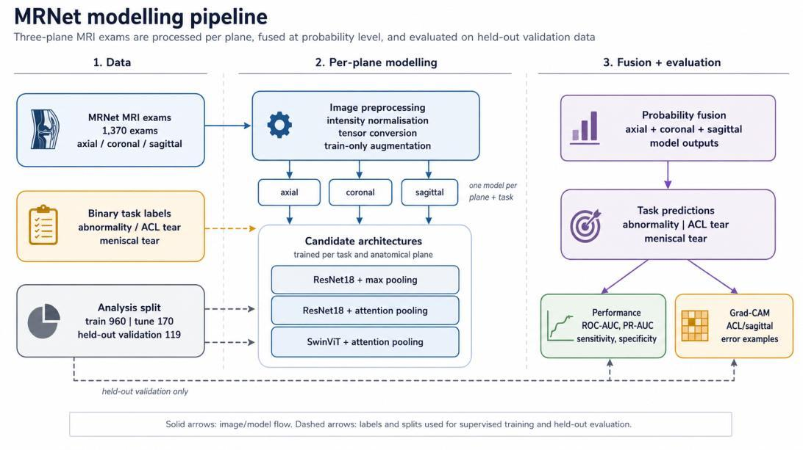
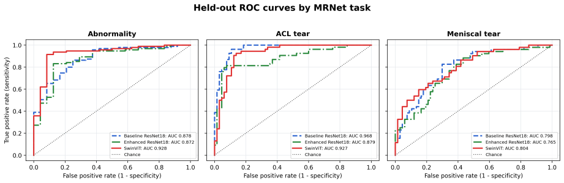
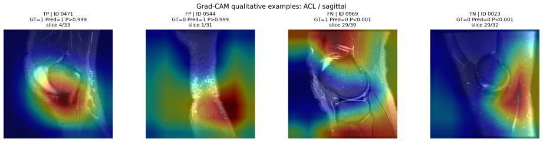
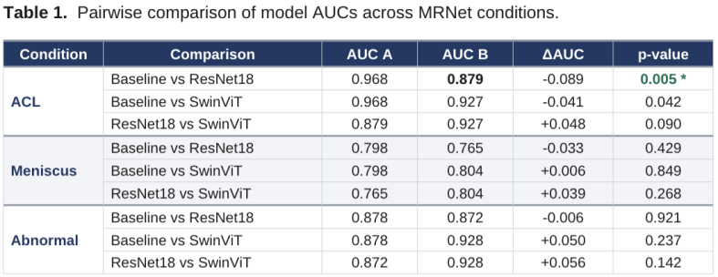
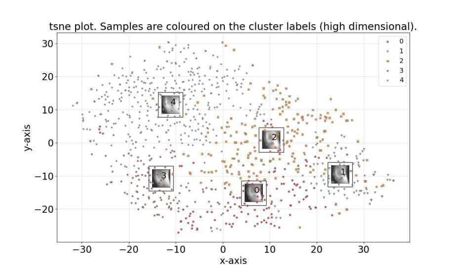

# MRNet Knee MRI Classification + Explainable AI (SHAP & Grad-CAM)

> MSc AI for Medicine · University College Dublin  
> Benchmarking Deep Learning Architectures for Automated Knee MRI Classification with Spatial Interpretability

---

## Overview

This repository benchmarks deep learning architectures for automated knee MRI classification using the [Stanford MRNet dataset](https://stanfordmlgroup.github.io/competitions/mrnet/) — **1,370 knee MRI examinations** across three anatomical planes (axial, coronal, sagittal), labelled for three clinical targets: **ACL tear**, **meniscal tear**, and **general abnormality**.

Three model families were systematically evaluated:
1. **Baseline ResNet-18** — ImageNet-pretrained backbone with slice-wise max-pooling aggregation.
2. **Enhanced ResNet-18** — learned per-slice attention pooling with two-stage training.
3. **Swin Transformer (Swin-Tiny)** — shifted-window hierarchical self-attention with attention pooling.

All architectures employ a **multi-plane probability fusion** strategy: three independent models (one per anatomical plane) are trained per task, and their output probabilities are combined to produce patient-level predictions.

Explainable AI (**Grad-CAM**) was applied to interrogate spatial representations and systematically evaluate model failures across True Positives (TP), False Positives (FP), False Negatives (FN), and True Negatives (TN).

---

## End-to-End Pipeline



The modelling workflow operates in three distinct stages:
1. **Data Ingestion & Preprocessing**: Loading axial, coronal, and sagittal MRI series; applying slice-wise data augmentation (random rotation, horizontal flips, affine translations) and intensity normalisation.
2. **Per-Plane Modelling**: Training plane-specific candidate backbones (ResNet-18 max-pool, ResNet-18 attention, SwinViT attention) for each condition.
3. **Multi-Plane Fusion & Evaluation**: Combining plane-level predictions via equal probability fusion; evaluating on a held-out test cohort (n=119 exams, N=357 pooled predictions) using ROC-AUC, PR-AUC, sensitivity, specificity, and Grad-CAM spatial localization.

---

## Key Results (Held-Out Test Set, n=119)

### Aggregate Performance Across All Outcomes
*Evaluated across pooled abnormality, ACL tear, and meniscal tear task predictions (N=357, 201 positive; decision threshold P >= 0.5):*

| Model Architecture | ROC-AUC | PR-AUC | Sensitivity | Specificity | Accuracy | F1 Score |
|:---|:---:|:---:|:---:|:---:|:---:|:---:|
| **Baseline ResNet-18 Fusion** | **0.898** | **0.910** | **90.5%** | 75.0% | **83.8%** | **0.863** |
| **Enhanced ResNet-18 (Attention)** | 0.859 | 0.890 | 81.6% | **76.3%** | 79.3% | 0.816 |
| **SwinViT Fusion** | 0.887 | 0.907 | 88.1% | 73.1% | 81.5% | 0.843 |

### Per-Task ROC-AUC

| Target Pathology | Baseline ResNet-18 | Enhanced ResNet-18 | Swin Transformer | Best Performer |
|:---|:---:|:---:|:---:|:---:|
| **Abnormality** | 0.878 | 0.872 | **0.928** | **Swin Transformer (+0.050)** |
| **ACL Tear** | **0.968** | 0.879 | 0.927 | **Baseline ResNet-18 (+0.041)** |
| **Meniscal Tear** | 0.798 | 0.765 | **0.804** | **Swin Transformer (+0.006)** |

### Held-Out ROC Curves



- **ACL tear classification** achieved the strongest discrimination, led by Baseline ResNet-18 (ROC-AUC **0.968**).
- **Abnormality detection** benefited most from the global receptive field of Swin Transformer (ROC-AUC **0.928**, PR-AUC 0.978).
- **Meniscal tear detection** proved the most challenging pathology across all models (ROC-AUC <= 0.804), reflecting the high subtlety and spatial confinement of meniscal fibrocartilage tears.

---

## Explainable AI: Grad-CAM Qualitative Error Analysis

To investigate whether models made decisions based on true anatomical pathology or spurious background artefacts, Gradient-weighted Class Activation Mapping (**Grad-CAM**) was evaluated on the sagittal ACL model:



| Prediction Outcome | Case ID | Ground Truth | Predicted | Probability | Clinical & Anatomical Observation |
|:---|:---:|:---:|:---:|:---:|:---|
| **True Positive (TP)** | ID 0471 | 1 | 1 | P > 0.999 | **Clinically plausible attention**: Hotspot sharply localises to the anatomical ACL trajectory and intercondylar notch. |
| **False Positive (FP)** | ID 0544 | 0 | 1 | P > 0.999 | **Spurious peripheral focus**: Activation concentrates along the posterior subcutaneous fat and popliteal space rather than the joint centre. |
| **False Negative (FN)** | ID 0969 | 1 | 0 | P < 0.001 | **Missed subtle tear**: Attentional focus remains diffuse across the distal femur and patellar tendon with absent ACL signal. |
| **True Negative (TN)** | ID 0023 | 0 | 0 | P < 0.001 | **Non-ligamentous background**: Low, dispersed activation away from the cruciate ligaments, correctly suppressing false alarms. |

> **Key Takeaway**: Grad-CAM serves reliably as an **error analysis tool** to detect peripheral shortcuts and subtle missed injuries, but should not be treated as standalone proof of radiologist-concordant reasoning.

---

## Statistical Significance (DeLong's Test)

Pairwise differences in ROC-AUC were tested using paired non-parametric DeLong tests with Bonferroni correction:



- Baseline ResNet-18 significantly outperformed Enhanced ResNet-18 on ACL tears (Delta AUC = -0.089, p = 0.005).
- Differences between Baseline ResNet-18 and Swin Transformer did not reach statistical significance after conservative multiple testing correction (p = 0.042 on ACL; p = 0.849 on Meniscus; p = 0.237 on Abnormality).

---

## Unsupervised Patient Clustering

To explore whether the 20.2% unannotated abnormal scans harboured latent pathological subcategories, PCA and K-Means/t-SNE clustering were performed:



Clustering revealed that latent groupings reflected imaging acquisition artefacts (intensity variations and field-of-view positioning) rather than distinct anatomical injury clusters, highlighting the risk of unsupervised stratification on raw volumetric scans.

---

## Repository Structure

```
mrnet-knee-mri-xai/
├── assets/                                 # High-resolution figures, Grad-CAM, & plots
│   ├── mrnet_pipeline_architecture.jpg     # End-to-end modelling pipeline
│   ├── gradcam_error_analysis.jpg          # Real Grad-CAM TP/FP/FN/TN breakdown
│   ├── roc_curves_heldout.png              # ROC curves for all tasks
│   ├── results_table_aggregate.png         # Aggregate performance summary
│   ├── delong_pairwise_significance.png    # Statistical hypothesis testing
│   └── tsne_patient_clusters.jpg           # t-SNE clustering analysis
├── notebooks/
│   ├── 00_mrnet_tutorial_baseline.ipynb    # Baseline tutorial & setup
│   ├── 01_mrnet_resnet_training.ipynb      # ResNet-18 max-pool training
│   ├── 02_mrnet_swin_training.ipynb        # Swin Transformer training
│   ├── 03_xai_gradcam.ipynb                # Grad-CAM saliency maps
│   ├── 04_xai_shap.ipynb                   # SHAP feature attribution
│   ├── 05_resnet_attention.ipynb           # Attention-pooling ResNet
│   └── 06_gradcam_pretrained_model.ipynb   # Grad-CAM with trained models
├── reports/
│   └── MRNet_report_group1.pdf             # Full academic group report (UCD)
├── requirements.txt
├── .gitignore
└── README.md
```

---

## Getting Started

### 1. Installation

```bash
git clone https://github.com/chinu85/mrnet-knee-mri-xai.git
cd mrnet-knee-mri-xai
pip install -r requirements.txt
```

### 2. Dataset Setup

Request access to the MRNet dataset at the [Stanford ML Group Portal](https://stanfordmlgroup.github.io/competitions/mrnet/).

Extract the dataset into `data/` preserving the plane structure:

```
data/
├── train/
│   ├── axial/
│   ├── coronal/
│   └── sagittal/
└── valid/
    ├── axial/
    ├── coronal/
    └── sagittal/
```

### 3. Training & Inference

Execute the numbered notebooks in sequence:
- `01_mrnet_resnet_training.ipynb`: Trains per-plane ResNet-18 models with slice max-pooling.
- `02_mrnet_swin_training.ipynb`: Trains hierarchical Swin Transformer models with windowed self-attention.
- `03_xai_gradcam.ipynb`: Computes Grad-CAM activations across test volumes.
- `04_xai_shap.ipynb`: Computes SHAP feature importance attributions.

---

## References

1. **Bien, N., et al.** (2018). *Deep-learning-assisted diagnosis for knee magnetic resonance imaging: Development and retrospective validation of MRNet.* PLoS Medicine, 15(11), e1002699.
2. **Selvaraju, R. R., et al.** (2017). *Grad-CAM: Visual explanations from deep networks via gradient-based localization.* IEEE ICCV.
3. **Liu, Z., et al.** (2021). *Swin Transformer: Hierarchical vision transformer using shifted windows.* IEEE ICCV.
